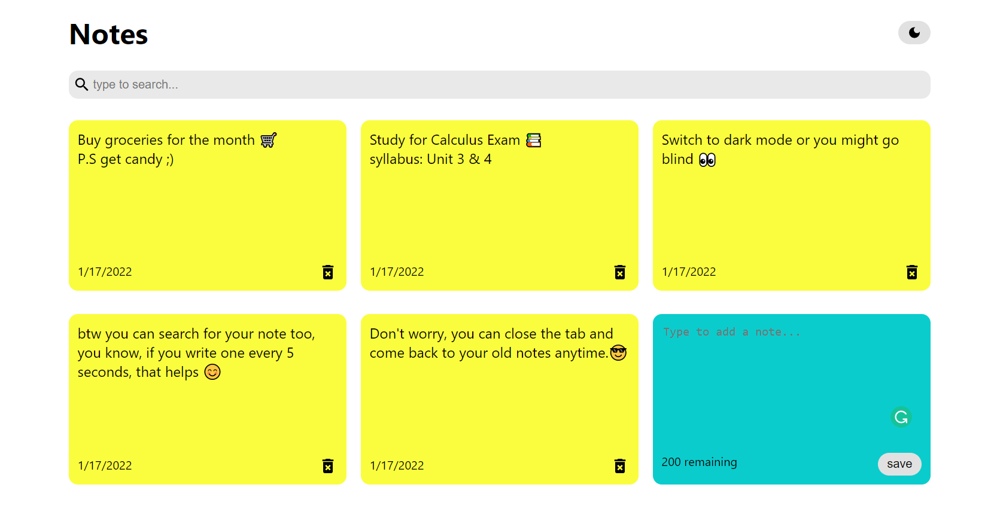

# Take a Note 📝

This react-based note app has it all. Search for your notes, go dark mode, and don't worry about closing the tab as it saves the notes to local storage.

## Try It
The app is currently hosted on netlify, [why don't you try it :)](https://takenotesnow.netlify.app/) 

## What did I learn
I learned how to store to local storage using the UseEffect Hook which I didn't know how to do before the project, and how to alter the CSS property to darkmode using the useState functions. I used a lot of prop drilling, which may not be the ideal strategy, but the context API method appeared to be too much to handle for this app.

